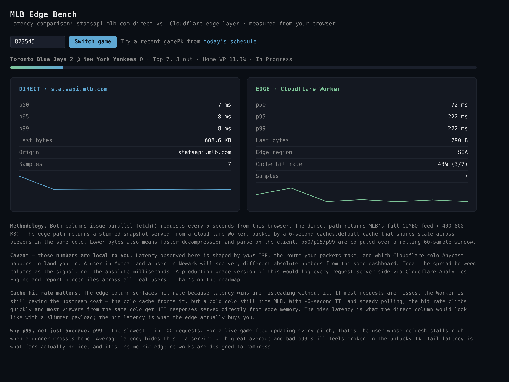

# MLB Edge Bench

**One upstream poll per game per 6 seconds, fanned out to every viewer in the world from the nearest Cloudflare colo — with a live latency benchmark against MLB's origin as proof.**

> **Live demo:** [mlb-edge-bench.fatehaszaman.workers.dev](https://mlb-edge-bench.fatehaszaman.workers.dev)



---

## What it is

The centerpiece is a fan-out pattern. A single Durable Object per `gamePk` polls MLB's GUMBO feed every 6 seconds, diffs it against the previous snapshot, and serves the slimmed result to every subscriber over Server-Sent Events. The upstream-to-fanout ratio is **1:N**, regardless of whether one fan or ten thousand fans are watching the same game. The free-tier deploy on `main` drops the DO and uses `caches.default` per-colo — same fan-out shape, scoped to the colo instead of global. The full DO+SSE version lives on the [`paid-tier`](https://github.com/fatehaszaman/mlb-edge-bench/tree/paid-tier) branch.

The benchmark dashboard is the proof. Two columns, same game, same browser:

- The **left** column calls `statsapi.mlb.com/api/v1.1/game/{gamePk}/feed/live` directly from your browser.
- The **right** column hits the Cloudflare Worker's slimmed snapshot endpoint (free tier) or subscribes via SSE (paid tier).

Both columns display p50/p95/p99 latency, byte counts, cache hit rate, the Cloudflare colo serving you, and a live sparkline. The numbers are real — they come from your own browser's `performance.now()` across a rolling 60-sample window.

```
┌─────────────────────────────────────────────────────────────────┐
│  MLB Edge Bench                              Yankees @ Blue Jays│
│  ─────────────                              Game 823545, B7 2O  │
├──────────────────────────────┬──────────────────────────────────┤
│  DIRECT · statsapi.mlb.com   │  EDGE · Cloudflare Worker (SSE)  │
│                              │                                  │
│  p50: 187 ms                 │  Avg latency: 12 ms              │
│  p95: 412 ms                 │  Avg bytes/update: 142 B         │
│  p99: 743 ms                 │  Total bytes (60): 8.4 KB        │
│  Last bytes: 487 KB          │  Edge region: EWR                │
│                              │  Upstream → fanout: 1 → 47 (47:1)│
│  ▁▂▃▄▃▅▄▆▅▇▆█▇█▇▆▅▄         │  ▁▁▁▁▁▁▁▂▁▁▁▂▁▁▁▁▁▁              │
└──────────────────────────────┴──────────────────────────────────┘
```

## Why

I was curious how much an edge layer would actually save for live MLB game data, measured end-to-end from a real client. The full GUMBO feed for one game is ~400–800 KB and updates every few seconds. The interesting question wasn't "can I cache it on the edge" — that's obvious. It was **"what does the edge actually buy you when measured the way a fan would experience it."** So I built a benchmark that runs both calls from the same client and surfaces the diff.

The framing is exploratory, not a critique. MLB's Stats API is a well-built single-origin service that's served fans well for a long time. This is one engineer engaging with a question that the people running mlb.com's edge already think about.

## Architecture

```
                        ┌──────────────────────────────────────┐
   User's browser ─────►│  Static dashboard (HTML+JS)          │
                        │  Direct: fetch() every 5s            │
                        │  Edge:   EventSource (SSE)           │
                        └──────┬───────────────────────────────┘
                               │
                ┌──────────────┴──────────────┐
                │                             │
                ▼                             ▼
    ┌────────────────────────┐    ┌────────────────────────┐
    │ statsapi.mlb.com       │    │ Worker @ edge          │
    │ (single origin)        │    │ /api/game/:id/stream   │
    └────────────────────────┘    └──────────┬─────────────┘
                                             │
                                             ▼
                                  ┌────────────────────────┐
                                  │ GameStateDO            │
                                  │ • polls MLB every 6s   │
                                  │ • diffs vs last state  │
                                  │ • serves cached JSON   │
                                  └──────────┬─────────────┘
                                             │
                                             ▼
                                  statsapi.mlb.com (one upstream
                                  request per game per 6s, regardless
                                  of how many fans are watching)
```

### Cloudflare primitives used

| Primitive | Used for |
|---|---|
| **Cloudflare Workers** (TypeScript) | Request routing, snapshot extraction, SSE |
| **Durable Objects** | One instance per active `gamePk`, holds live state |
| **Alarms API** | DO self-polls MLB every 6 seconds |
| **Edge Cache** | Available for finished games via `caches.default` |
| **Server-Sent Events** | Push structural diffs to dashboard clients |
| **`request.cf` geolocation** | Surface which colo served each request |

The key architectural property: regardless of how many fans are watching a given game, **exactly one upstream request hits `statsapi.mlb.com` per game per 6 seconds.** The DO fans out its in-memory state to every viewer. The `/api/game/:id/stats` endpoint exposes the upstream-to-fanout ratio in real time, and the dashboard surfaces it.

### What's on the wire

| Path | Payload | Typical size |
|---|---|---|
| Direct `feed/live` | Full GUMBO feed | ~400–800 KB |
| Edge `/snapshot` | Slimmed JSON snapshot | ~400 B |
| Edge `/stream` (initial) | Full snapshot SSE message | ~500 B |
| Edge `/stream` (diff) | Just the fields that changed | ~50–200 B |

## Methodology

Both columns observe the same game from the same client.

- The **direct** column issues `fetch()` requests every 5 seconds and measures end-to-end latency with `performance.now()`.
- The **edge** column subscribes to the Worker's SSE stream once. The first message is a full snapshot; subsequent messages are structural diffs of just the fields that changed since the last sample. Per-message bytes are measured from the raw event data.

p50/p95/p99 on the direct column are computed over a rolling 60-sample window. The edge column reports average latency (round-trip time isn't strictly comparable for an open SSE channel) and average / total bytes per update.

## Win probability

`homeWinProbability` is my own closed-form approximation, not pulled from the GUMBO feed. MLB's feed doesn't expose a WP field on most endpoints, and the ones that do are derived server-side from a different model. I wanted the snapshot to be self-contained, so [`src/snapshot.ts`](src/snapshot.ts) computes it from inning, half, outs, base state, and run differential — plus walk-off edge cases that are mathematically decided.

It's intentionally **not** the centerpiece. The centerpiece is the delivery layer. The function is structured so a Retrosheet-fitted lookup table (or a real model) can swap in without touching the Worker or DO.

## Limitations & honest caveats

- This is a personal exploration project, not a load test. The dashboard runs both fetches in parallel from the same browser, which is the realistic comparison a fan would experience.
- **Numbers are local to the viewer.** Latency depends heavily on your ISP, the route your packets take, and which Cloudflare colo Anycast lands you in. A user in Mumbai and a user in Newark will see very different absolute numbers from the same dashboard. Treat the spread between columns as the signal, not the absolute ms. A production version would log every request server-side via Analytics Engine and report percentiles across all real users.
- **Cache hit rate is surfaced alongside latency** because latency without hit rate is misleading. A cold colo still pays the upstream cost; the dashboard shows the HIT/total ratio so you can tell which regime you're observing.
- **p99, not just average.** p99 = the slowest 1 in 100 requests. For a live game feed updating every pitch, that's the user whose refresh stalls right when a runner crosses home. Average hides this. Tail latency is what fans actually notice.
- The SSE channel is capped at 5 minutes per connection to stay polite to the free tier; the client reconnects automatically.
- Win probability is approximate and should not be used for decision-making.

## Develop

```bash
# Node 20+ and a free Cloudflare account
npm install
npx wrangler login

npm run dev         # http://localhost:8787/
npm run typecheck
npm run deploy      # live at https://mlb-edge-bench.<handle>.workers.dev/
```

To switch games on the dashboard, paste a `gamePk` from [today's schedule](https://statsapi.mlb.com/api/v1/schedule?sportId=1) into the input box and hit *Switch game*.

## File layout

```
src/
  index.ts        Worker entry + routes + GameStateDO
  snapshot.ts     Pure functions: GUMBO → slimmed snapshot, WP, diffs
  dashboard.ts    Inline HTML + JS for the benchmark page
wrangler.toml     Worker + Durable Object bindings
```

## License

MIT
